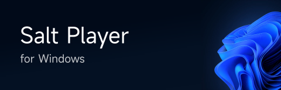

# Salt Player - एक स्थानीय म्यूजिक प्लेयर जिसे लाखों उपयोगकर्ताओं द्वारा चुना और भरोसा किया गया है

Salt Player एक स्थानीय संगीत प्लेबैक ऐप है। यह रिपॉजिटरी नए संस्करणों को जारी करने, फीडबैक एकत्र करने और घोषणाओं को पोस्ट करने के लिए उपयोग की जाती है।

## डाउनलोड चैनल

### एंड्रॉइड

Salt Player *for Android* को Android 6.0 या उससे ऊपर की आवश्यकता होती है और यह arm64-v8a और armeabi-v7a आर्किटेक्चर को सपोर्ट करता है।

| चैनल | रिलीज़ | परिचय | ⚠️ नोट |
|:--|:--|:--|:--|
| Moriafly | 1. [Github Release](https://github.com/Moriafly/SaltPlayerSource/releases)   2. [CoolApk](https://www.coolapk.com/apk/284064) | स्टैंडर्ड पैकेज | Coolapk पर रिलीज़ केवल arm64-v8a आर्किटेक्चर के लिए उपलब्ध है। |
| Google Play | [Google Play](https://play.google.com/store/apps/details?id=com.salt.music) | गूगल प्ले स्टोर चैनल पैकेज | 1. arm64-v8a और armeabi-v7a आर्किटेक्चर का डायनामिक वितरण सपोर्ट करता है।   2. Google Play संस्करण को Google द्वारा साइन और रिलीज़ किया गया है, जो इसे स्टैंडर्ड पैकेज के साथ **असंगत** बनाता है।   3. यह विशेष स्थिर संस्करण या कस्टम-बिल्ट संस्करणों को चुनता है, जो स्टैंडर्ड पैकेज से अलग अपडेट रणनीति का पालन करता है। |

नोट: कृपया इस ऐप को केवल आधिकारिक चैनलों से डाउनलोड करें। अज्ञात या असत्यापित हस्ताक्षर वाली इंस्टॉलेशन फाइल्स का उपयोग न करें।

#### संस्करण (फ़ाइल) नामकरण कन्वेंशन

उदाहरण के लिए, APK फ़ाइल का नाम 10.5.0.2-release-2024091902-moriafly-arm64-v8a का अर्थ निम्नलिखित है:

| टेक्स्ट | प्रतिनिधित्व करता है | परिचय |
|:--|:--|:--|
| 10.5.0.2 | संस्करण नाम | 10 प्रमुख संस्करण, 5 गौण संस्करण, 0 पैच संस्करण, और 2 आपातकालीन सुधार गणना का प्रतिनिधित्व करता है (आमतौर पर यदि 0 हो तो छोड़ दिया जाता है, जैसे 10.4.4)। |
| release | संस्करण प्रकार | 1. release एक स्थिर संस्करण को दर्शाता है, beta सार्वजनिक परीक्षण संस्करण, और alpha आंतरिक परीक्षण संस्करण को।   2. रिलीज़ प्रकार आमतौर पर छोड़ा जाता है, और alpha संस्करण भी सार्वजनिक रूप से जारी किए जा सकते हैं लेकिन उनमें स्थिरता कम होती है।   3. स्थिरता क्रम: release > beta > alpha (कुछ हद तक व्यक्तिपरक)। |
| 2024091902 | संस्करण कोड | उदाहरण: 2024091902 दर्शाता है कि यह संस्करण 19 सितंबर 2024 को दूसरी बार बनाया गया था। |
| moriafly | चैनल आईडी | चैनल तालिका देखें। |
| arm64-v8a | आर्किटेक्चर | चैनल तालिका देखें। |

### विंडोज़

विवरण के लिए देखें [SPW](https://github.com/Moriafly/SPW) दस्तावेज़।

## ओपन सोर्स संबंधित

[Salt UI](https://github.com/Moriafly/SaltUI) *Compose Multiplatform (Android/Desktop/iOS) के लिए UI घटक।*

## स्थानीयकरण अनुकूलन

विवरण के लिए, [Translations](translations) दस्तावेज़ देखें।

## सिस्टम अनुकूलन

| सिस्टम | फीचर्स | स्थिति | विवरण |
|:--|:--|:--|:--|
| Xiaomi MIUI/Hyper OS | Mi Magic Broadcast | 🟢 समर्थन | 1. MIUI 12 या ऊपर की आवश्यकता है ताकि Mi Cast फ़ंक्शन को कॉल किया जा सके, Salt Player प्लेबैक स्क्रीन के ऊपरी दाएँ कोने में बटन पर क्लिक करें।   2. यह कार्य Mi स्क्रीन प्रोजेक्शन के संबंधित सिस्टम घटकों पर आधारित है, यदि यह अमान्य है, तो कृपया जांचें कि संबंधित घटक अक्षम तो नहीं हैं। |
| | CarWith | 🟢 समर्थन | 26 दिसंबर, 2024 को CarWith V3.3.6 समर्थन, Xiaomi के आधिकारिक समर्थन के लिए धन्यवाद। |
| | कवर स्क्रीन डिस्प्ले (जैसे Mix Flip) | 🟢 समर्थन | |
| | MIUI/Hyper OS विजेट | 🟠 विकास में | विकास की प्रतीक्षा कर रहा है। |
| HUAWEI HarmonyOS | संगीत नियंत्रण केंद्र | 🔴 असमर्थित | श्वेतसूची नियंत्रण और कोई अनुकूलन दस्तावेज़ नहीं मिला, संचार विफल। |
| vivo OriginOS/Funtouch OS | Joviincar स्मार्ट कार | 🟢 समर्थन | 1. 29 अगस्त, 2024 को vivo Smart Car V4.0.7.3 संस्करण Salt Player का समर्थन जोड़ता है।   2. परीक्षण संस्करण है, joviincar के लिए लिरिक्स डिस्प्ले असमर्थित है, लेकिन ब्लूटूथ के माध्यम से लिरिक्स दिखाए जा सकते हैं। |
| | Hi-Fi | 🔵 मैनुअल | 1. `settings put global game_support_hifi_list com.salt.music` को adb के माध्यम से जोड़ें।   2. Hi-Fi सूची में Salt Player जोड़ें, फिर System Settings > Sound & Vibration > Enable Hi-Fi पर जाएँ।   3. आपका डिवाइस Hi-Fi को सपोर्ट करता है या नहीं, इसके लिए vivo की आधिकारिक वेबसाइट देखें। |
| | एटॉमिक वॉकमैन | 🔴 असमर्थित | श्वेतसूची की संभावना, कोई दस्तावेज़ नहीं मिला।   [#749](https://github.com/Moriafly/SaltPlayerSource/issues/749) |
| OPPO ColorOS | फ्लूइड क्लाउड | 🟢 समर्थन | 4 नवंबर, 2024 से ग्रेस्केल परीक्षण शुरू हुआ, OPPO के आधिकारिक समर्थन के लिए धन्यवाद। |
| Meizu Flyme | स्टेटस बार लिरिक्स | 🟢 समर्थन | |
| | डायनामिक रिंग | 🔴 असमर्थित | श्वेतसूची की संभावना, कोई दस्तावेज़ नहीं मिला। |

## वे फ़ीचर्स जिनका अब समर्थन या रखरखाव नहीं किया जाता

| फ़ीचर | समाप्ति समय | विवरण |
|:--|:--|:--|
| DSD ऑडियो (.dsf/.dff) | 2024 | पुराने फ़ॉर्मेट माने जाते हैं, कृपया FLAC में बदलें   विवरण के लिए देखें [Salt Player ends maintenance and support for DSD format](articles/240902_Deprecated_DSD.md)। |

## रिपॉजिटरी योगदानकर्ता

## कानूनी जानकारी

**Android** Google LLC का ट्रेडमार्क है।

**Android Robot** Google की मूल कृति पर आधारित एक पुनःनिर्माण या संशोधित संस्करण है और इसे [Creative Commons](https://creativecommons.org/licenses/by/3.0/) Attribution 3.0 License की शर्तों का पालन करना होगा।

**Salt Player** और **糖醋音乐** पीपुल्स रिपब्लिक ऑफ चाइना में Xunxun Technology (Shanghai) Co., Ltd. के पंजीकृत ट्रेडमार्क हैं।

अधिक कानूनी जानकारी के लिए, कृपया सॉफ़्टवेयर और संबंधित वेबसाइटों को देखें।
