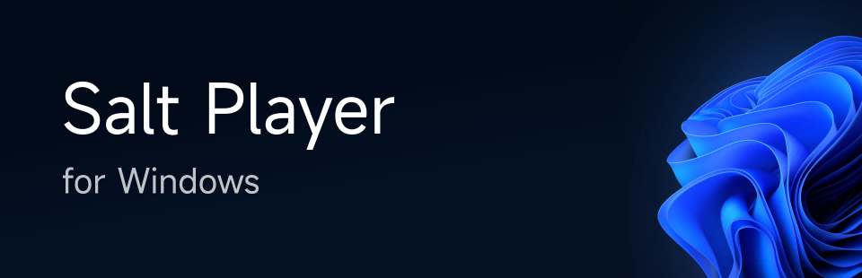

# Salt Player - A local music player trusted and chosen by hundreds of thousands of users

Select Language: [简体中文](README-zh-hans.md), [Русский](README-ru.md), [Indonesia](README-id.md)

Salt Player is a local music playback app. This repository is used for releasing new versions, collecting feedback, and posting announcements.

## Download Channel

### Android

Salt Player *for Android* requires Android 6.0 or higher and supports the arm64-v8a and armeabi-v7a architectures.

| Channel | Release | Introduction | ⚠️ Note |
|:--|:--|:--|:--|
| Moriafly | 1. [Github Release](https://github.com/Moriafly/SaltPlayerSource/releases)   2. [CoolApk](https://www.coolapk.com/apk/284064) | Standard Package | The release on Coolapk is available only for the arm64-v8a architecture. |
| Google Play | [Google Play](https://play.google.com/store/apps/details?id=com.salt.music) | Google Play Store Channel Package | 1. Supports dynamic distribution of the arm64-v8a and armeabi-v7a architectures.   2. The Google Play version is signed and released by Google, which makes it **incompatible** with the standard package.   3. Selects special stable releases or custom-built versions, following a different update strategy compared to the standard package. |

Note: Please download this app from the official channels. Do not use installation files with unknown or unverified signatures.

#### Version (File) Naming Convention

For example, the APK filename 10.5.0.2-release-2024091902-moriafly-arm64-v8a has the following meaning:

| Text | Represent | Introduction |
|:--|:--|:--|
| 10.5.0.2 | Version Name | 10 represents the major version, 5 represents the minor version, 0 represents the patch version, and 2 represents the emergency fix count (usually omitted if 0, for example, directly writing the version as 10.4.4). |
| release | Version Type | 1. The release represents a stable version, beta represents a public testing version, and alpha represents an internal testing version.   2. The release type is usually omitted, and alpha versions may also be publicly released but indicate lower stability.   3. Stability order: release > beta > alpha (subjective judgment may apply). |
| 2024091902 | Version Code | The version code of Salt Player *for Android* has specific meaning. For example, 2024091902 indicates that this version was built for the second time on September 19, 2024. |
| moriafly | Channel ID | See channel table. |
| arm64-v8a | Architecture | See channel table. |

### Windows

For details, see the [SPW](https://github.com/Moriafly/SPW) documentation.

## Open Source Related

[Salt UI](https://github.com/Moriafly/SaltUI) *UI Components for Compose Multiplatform (Android/Desktop/iOS).*

## Localization Adaptation

For details, see the [Translations](translations) documentation.

## System Adaptation

| System | Features | Status | Description |
|:--|:--|:--|:--|
| Xiaomi MIUI/Hyper OS | Mi Magic Broadcast | 🟢 Support | 1. MIUI 12 or above is required to call the Mi Cast function, click the button in the upper right corner of the Salt Player playback screen to automatically jump.   2. This function is based on the relevant system components of Mi Screen Projection, if it is invalid, please check whether the related components are disabled. |
| | CarWith | 🟢 Support | December 26, 2024 CarWith V3.3.6 support, thanks to Xiaomi official support. |
| | Cover screen display (e.g. Mix Flip) | 🟢 Support | |
| | MIUI/Hyper OS widget | 🟠 Follow-up | Waiting for development. |
| HUAWEI HarmonyOS | Music Control Center | 🔴 Not supported | Whitelist control and no adaptation documents found, contact and communication are fruitless. |
| vivo OriginOS/Funtouch OS  | Joviincar Smart Car | 🟢 Support | 1. August 29, 2024 vivo Smart Car V4.0.7.3 version adds support for Salt Player, thanks to users who have given feedback to vivo and vivo's official support.   2. The trial version, the lyrics display of joviincar is not supported for the time being (the adaptation method is not clear), and the lyrics can be simulated through the car Bluetooth lyrics. |
| | Hi-Fi | 🔵 Manual | 1. Add `settings put global game_support_hifi_list com.salt.music` via adb.   2. Add Salt Player after entering the Hi-Fi list, go to System Settings > Sound & Vibration > Enable Hi-Fi.   3. Whether the device supports the Hi-Fi function, please go to the product page of vivo official website to understand. |
| | Atomic Walkman | 🔴 Not supported | Suspected whitelist, no adaptation document found.   [#749](https://github.com/Moriafly/SaltPlayerSource/issues/749) |
| OPPO ColorOS | Fluid Cloud | 🟢 Support | Grayscale testing will be carried out from November 4, 2024, thanks to OPPO's official support. |
| Meizu Flyme | Status bar lyrics | 🟢 Support | |
| | Dynamic Ring | 🔴 Not supported | Suspected whitelist, no adaptation document found. |

## Features That Are No Longer Maintained or Supported

| Feature | Deprecation time | Description |
|:--|:--|:--|
| DSD Audio (.dsf/.dff) | 2024 | Considered an obsolete format, it is recommended to replace it with FLAC   For details, see [Salt Player ends maintenance and support for DSD format](articles/240902_Deprecated_DSD.md). |

## Repository Contributors

## Legal Information

**Android** is a trademark of Google LLC.

**Android Robot** is a re-creation or modification based on Google's original creation and shared achievements, and must comply with the terms of the [Creative Commons](https://creativecommons.org/licenses/by/3.0/) Attribution 3.0 License.

**Salt Player** and **糖醋音乐** are registered trademarks of Xunxun Technology (Shanghai) Co., Ltd. in the People's Republic of China.

For more legal information, please refer to the software itself and related websites.