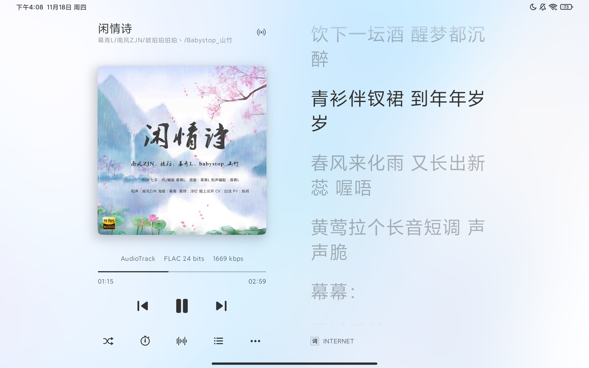
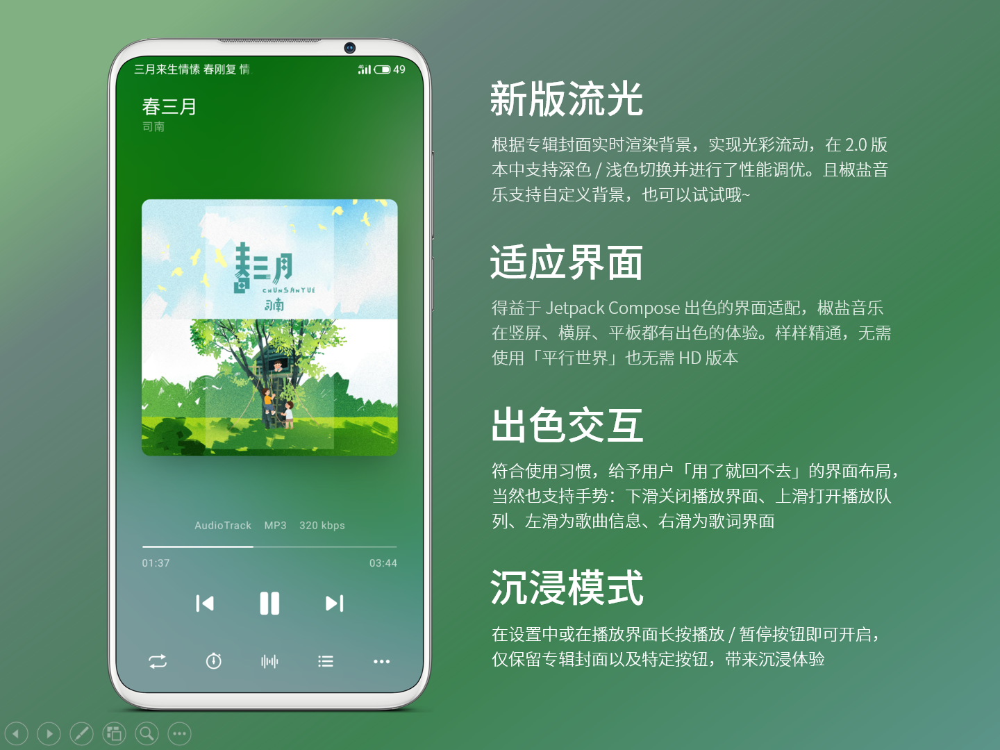

    <h2>椒盐音乐 Salt Player</h2>
     
    <a href="http://moriafly.xyz/SaltPlayerSource/index.html#/" target="_blank">moriafly.xyz/SaltPlayerSource</a>

 
使用 <a href="https://developer.android.google.cn/jetpack/compose" target="_blank">Jetpack Compose</a> 开发的 Android 音乐播放器软件。
注意本仓库是用来发布更新椒盐音乐新版本、收集反馈、发布一些通知的，而不是椒盐音乐的完整开源库。椒盐音乐属于<b>闭源软件</b>。

---

## 💕 软件介绍

[椒盐音乐](https://moriafly.xyz/SaltPlayerSource/index.html#/) 是一款 Android 本地音乐播放器软件。

#### 1. 开发技术实力

椒盐音乐使用 Jetpack Compose 构建 Android 原生应用，并使用自研架构管理，保证了出色且生动的软件界面和较高的稳定性。数十万行级别的 Koltin / Java / C / C++ 共同完成了此应用。

作者为自学的 Android 开发，以一名普通的用户角度去设计完成，在一年间发布了几百个更新版本，保证了软件的高维护。

#### 2. 音频技术

椒盐音乐音频技术部分来自著名音频库（已获授权），并有使用了 FFmpeg 相关技术（部分代码公布于作者其他仓库）。

出色的音频技术为椒盐音乐带来了 AudioTrack、OpenSL ES、AAudio 输出。支持可变采样率音频等等。

格式支持：Mpeg 1 / 2 / 3、WAV、FLAC、APE、ALAC、AAC、DSD、WV、OGG 。

内置均衡器，支持参数均衡。

#### 3. 友好界面

椒盐音乐依据用户使用习惯对交互进行了优化，本地音乐软件应该是友好的，颜值实力并存。

竖屏、横屏、平板界面样样精通。

#### 4. 歌词功能

椒盐音乐支持内嵌（FLAC、MP3）歌词、LRC 歌词、网络歌词。支持滚动歌词、车载蓝牙歌词、魅族等系统级别状态栏歌词、Xposed 状态栏歌词、桌面歌词、迷你播放条歌词。满足你的歌词需求。

详见 [为本地音乐播放机带来更好的歌词体验](help/lyrics.md)

## 😎 椒盐音乐最新版下载地址

`请在正确的渠道下载本应用，请勿使用他人重新签名的安装文件。`

[Github release](https://github.com/Moriafly/SaltPlayerSource/releases) | [Google Play](https://play.google.com/store/apps/details?id=com.salt.music) | [酷安](https://www.coolapk.com/apk/284064) | [ApkPure](https://apkpure.com/p/com.salt.music)

## 🕊️ 开放文档

[点击查看开放文档](open/open.md)

## 🍨 使用帮助

[扫描音乐帮助](help/scanmusic.md) | [歌词帮助](help/lyrics.md) | [其他帮助](help/other.md)

## 🌈 会在这里分享椒盐音乐相关开发进度以及部分源代码（若可能）

[2021-07-30 安卓拓展 MediaPlayer 实现淡入淡出效果](https://blog.csdn.net/Moriafly/article/details/119251186)

[2021-10-25 如何保护你的安卓应用？这有一些方法](https://blog.csdn.net/Moriafly/article/details/120953086)

## ✉️ 可以通过提交 issue 来反馈你在椒盐音乐使用中遇到的问题

建议先查看应用内帮助文档，若无法解决请提交 issue 。**注意不接收任何 UI 样式调整相关的反馈（如 “我个人不喜欢某处的界面样子” 等等主观反馈，但不包含 UI 异常错误的反馈）**，个人独立开发应用很难很难很难做到符合人人的喜欢，就像做菜对吧，咸淡总不同，我通常无法提供多种 “不同口味的菜品” ，希望理解。

`特别注意，多问题请分开提交多个 issue ，请勿写在一起！`

## 📧 关注进度和联系开发者

Telegram 频道：https://t.me/saltplayerupdate

开发者邮箱：moriafly@163.com

`注意：酷安平台任何非开发者账号发布的有关椒盐音乐更新、发布和规划信息均不被本开发者承认。`

## 🌏 本地化适配

可以提交到 [translations](https://github.com/Moriafly/SaltPlayerSource/tree/main/translations) 中帮助我们翻译哦~

## ✨ 说明

椒盐音乐安装包大小约 10 MB ，解压安装后约占用 30 MB 空间（后续使用产生的用户数据不包含）。
**仅提供 64 位版本（架构 arm-v8a），需要安卓 6.0 以上。**

椒盐音乐内含有一些处理实现，请勿使用太极、应用转生对椒盐音乐处理，可能会导致音乐服务无法正常启动；请谨慎在 Xposed 环境下使用，可能造成 MiniPlayer 崩溃。

**Google Play 版本由谷歌签名发布，与此仓库安装包不兼容。**

___

本软件相关音频技术已获授权。